# Shipyard IDP

> Self-service Internal Developer Platform — provision GitHub repos, CI/CD pipelines, and cloud databases in under 3 minutes.


---

## The Problem

At most companies, when a developer needs a new microservice they:

1. File a ticket → wait 1-2 days for a GitHub repo
2. File another ticket → wait for CI/CD pipeline setup
3. File another ticket → wait 2-3 days for a database
4. Finally start writing code — **a week later**

**Shipyard IDP eliminates this entirely.**

---

## The Solution

A developer opens Backstage, fills out a form, clicks Create.
In under 3 minutes they have:

- ✅ GitHub repository with branch protection rules
- ✅ GitHub Actions CI/CD pipeline — ready to run
- ✅ PostgreSQL or MySQL database on AWS RDS (optional)
- ✅ Service registered in the Backstage catalog
- ✅ Automatically deployed to Kubernetes via ArgoCD
- ✅ Metrics visible in Grafana immediately

No tickets. No waiting. No platform team bottleneck.

---

## Architecture



---

## Tech Stack

| Layer | Tool | Purpose |
|---|---|---|
| Developer Portal | Backstage | Self-service UI, service catalog, templates |
| GitOps | ArgoCD | Automated deployments from Git |
| Infrastructure | Crossplane | AWS resource provisioning (RDS, S3) |
| IaC | Terraform | EKS cluster + VPC provisioning |
| CI/CD | GitHub Actions | Auto-generated per service |
| Observability | Prometheus + Grafana | Platform and service metrics |
| Orchestration | Kubernetes (Kind/EKS) | Container orchestration |
| Database | PostgreSQL | Backstage internal database |

---

## Prerequisites

- Docker Desktop
- kubectl
- Kind
- Helm
- Terraform
- Node.js v18+
- Yarn
- AWS CLI configured (for cloud deployment)
- GitHub personal access token (repo + workflow permissions)

Install all on Mac:
```bash
brew install kubectl helm terraform kind node awscli
npm install -g yarn
```

---

## Quick Start

### Local (Kind cluster — free)
```bash
git clone https://github.com/hritikmunde/shipyard-idp
cd shipyard-idp
./bootstrap.sh
# Choose option 1 (Local)
# Enter GitHub username and token
```

Access your platform:
```bash
# Terminal 1
kubectl port-forward svc/backstage -n backstage 3000:80

# Terminal 2  
kubectl port-forward svc/backstage -n backstage 7007:80

# Terminal 3 (ArgoCD)
kubectl port-forward svc/argocd-server -n argocd 8080:443

# Terminal 4 (Grafana)
kubectl port-forward svc/monitoring-grafana -n monitoring 3001:80
```

| Service | URL | Credentials |
|---|---|---|
| Backstage | http://localhost:3000 | Guest login |
| ArgoCD | https://localhost:8080 | admin / see bootstrap output |
| Grafana | http://localhost:3001 | admin / shipyard123 |

### Cloud (AWS EKS — production grade)
```bash
./bootstrap.sh
# Choose option 2 (Cloud)
# Enter AWS credentials, GitHub token, region
# Wait ~15 minutes
# Access via LoadBalancer URLs printed at end
```

Tear down when done:
```bash
./teardown.sh
# Choose option 2 (Cloud)
# Type 'destroy' to confirm
# All AWS resources deleted, billing stops
```

---

## Creating Your First Service

1. Open Backstage at http://localhost:3000
2. Click **Create** in the left sidebar
3. Choose **Create a New Microservice**
4. Fill in:
   - Service name (e.g. `payment-service`)
   - Description
   - Check "Provision a database?" if needed
5. Enter your GitHub username and repo name
6. Click **Create**

Within 3 minutes:
- GitHub repo exists at `github.com/YOUR_USERNAME/payment-service`
- CI/CD pipeline is running
- Service appears in Backstage catalog
- ArgoCD begins syncing deployment to Kubernetes

---

## Project Structure
```
shipyard-idp/
├── bootstrap.sh              # One-command setup (local + cloud)
├── teardown.sh               # One-command cleanup
├── kind-config.yaml          # Local cluster config
│
├── shipyard/                 # Backstage application
│   ├── app-config.yaml       # Local configuration
│   ├── app-config.production.yaml  # Production configuration
│   └── examples/
│       ├── org.yaml          # Sample org structure
│       └── templates/
│           └── service-template.yaml  # Microservice template
│
├── argocd/                   # GitOps configuration
│   ├── root-app.yaml         # App of Apps root
│   └── apps/                 # Per-service app definitions
│
├── crossplane/               # AWS resource provisioning
│   ├── provider-aws.yaml     # AWS providers (EC2, RDS)
│   └── provider-config.yaml  # AWS credentials config
│
├── k8s/                      # Kubernetes manifests
│   └── backstage/            # Backstage deployment
│
├── monitoring/               # Observability
│   └── argocd-servicemonitor.yaml
│
└── terraform/                # AWS infrastructure (EKS)
    ├── main.tf
    ├── variables.tf
    ├── outputs.tf
    ├── helm.tf
    └── providers.tf
```

---

## How It Works — End to End
```
1. Developer fills Backstage template form
          ↓
2. Backstage runs scaffolding steps:
   a. Creates GitHub repo via GitHub API
   b. Pushes skeleton code (README, CI pipeline, catalog-info.yaml)
   c. Creates Crossplane claim for RDS (if database requested)
   d. Registers service in Backstage catalog
          ↓
3. ArgoCD detects new app definition in argocd/apps/
   → Automatically syncs service to Kubernetes
          ↓
4. Crossplane detects RDS claim
   → Calls AWS API
   → Provisions RDS instance in same VPC
   → Stores connection string as Kubernetes secret
          ↓
5. Prometheus begins scraping new service metrics
   → Visible in Grafana immediately
```

---

## Design Decisions

### Why Crossplane over Terraform for per-service resources?
Terraform is ideal for base infrastructure (VPC, EKS) that changes infrequently. Crossplane is better for on-demand resources (databases, buckets) because it runs continuously in Kubernetes, enables self-service without CI/CD pipelines, and provides drift detection every 10 seconds.

### Why ArgoCD over push-based CD?
GitOps ensures the cluster state always matches Git. ArgoCD detects and corrects drift automatically. Push-based deployment has no reconciliation — if someone manually changes a resource, it stays changed.

### Why Backstage over a custom portal?
Backstage has a large plugin ecosystem, active community, and is the industry standard for IDPs (used by Spotify, Netflix, Zalando, and hundreds of enterprises). Building custom would take months.

### Why Kind for local development?
Kind provides a production-equivalent Kubernetes environment with zero cost. The same manifests work on both Kind and EKS — only the infrastructure layer changes.

---

## Production Considerations

Things you'd add before running this in production:

- **Authentication** — Replace guest auth with GitHub OAuth or Okta SSO
- **HTTPS** — TLS certificates via cert-manager
- **Secrets management** — HashiCorp Vault or AWS Secrets Manager instead of K8s secrets
- **RBAC** — Fine-grained permissions per team
- **Backstage database** — Managed RDS for Backstage itself (currently using in-cluster PostgreSQL)
- **Multi-cluster** — ArgoCD managing multiple environments (dev/staging/prod)
- **SBOM + image signing** — Supply chain security via cosign + OPA Gatekeeper

---

## Screenshots

### Backstage — Service Catalog
*All services visible in one place with owner, health status, and documentation*

### Backstage — Create New Microservice
*Developer fills out form — no tickets required*

### ArgoCD — GitOps Dashboard
*All services synced and healthy*

### Grafana — Platform Observability
*Real-time metrics for all ArgoCD applications*

---

## License

MIT
